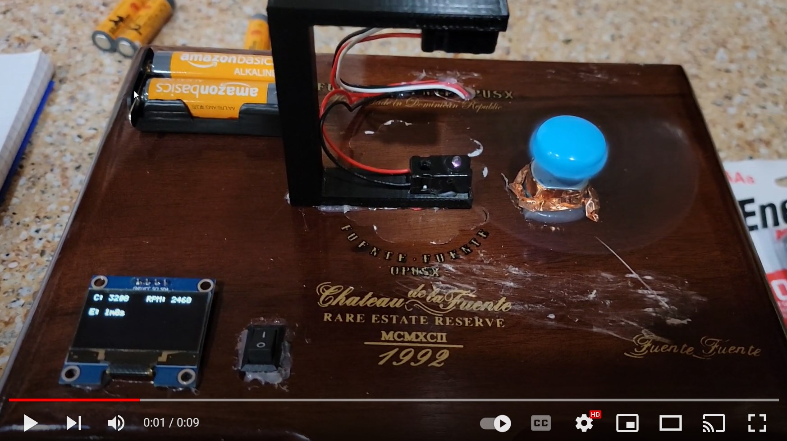
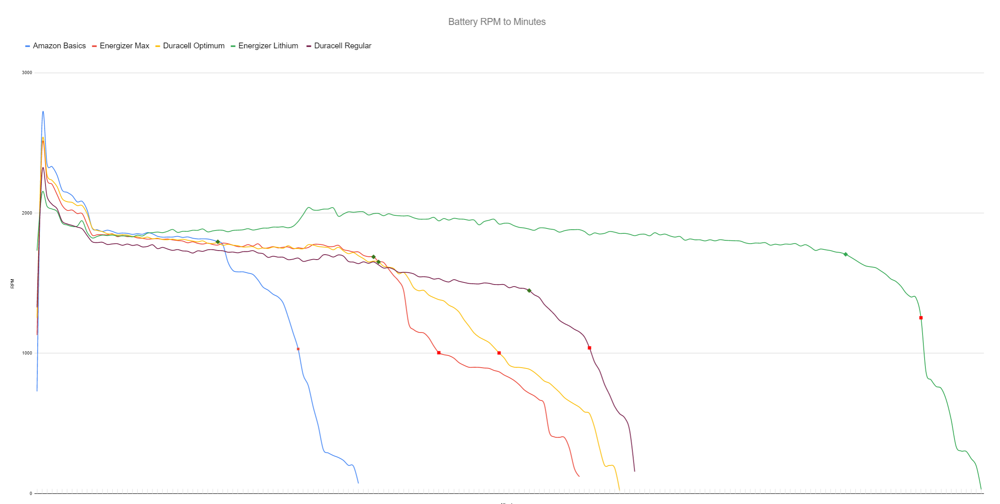
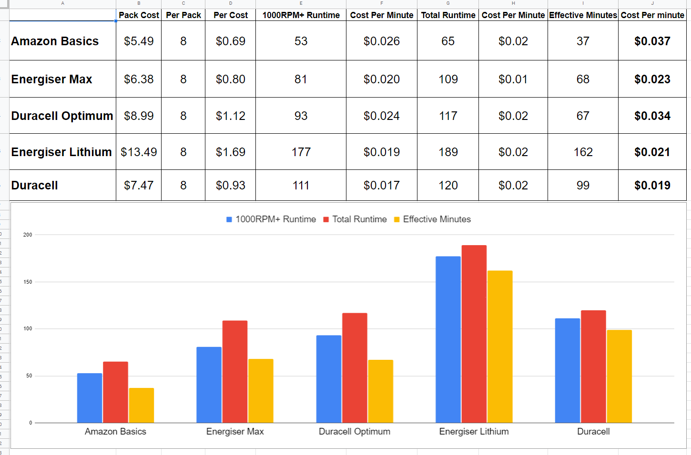

# Battery Tester

My 9 year old wanted to test different batteries for his science fair project.  Figured this would be a fun time to play with some dotnet core 6 running on a pi3 with a sensor and a screen. Most of this code was written by my child - figured it was a good time to get him to code something.

Parts Requirements

| Part | Where to Buy
| :--- | :---
| DC Motor/Fan/Switch Kit | https://www.amazon.com/gp/product/B077WWS63B
| IR Sensor | https://www.adafruit.com/product/2167
| Screen | https://www.amazon.com/gp/product/B07BHHV844
| Pi    | Anywhere
| Box   | Anywhere
| Breadboard | Anywhere
| Hot Glue | Anywhere
| Duck Tape | Anywhere - this was used to block IR from passing through the blade

Created Parts:
We used our 3d printer to create an overhang to hang the Adafruit IR sensor.

_Notes:_
If the IR sensor gets to close to the DC motor, it appears that the EMI can send signals down the line to the GPIO on the RP, which makes a false trigger. To get away from this, we moved the IR sensor away (mounted higher than the DC motor instead of off to its side.

Note: This project uses Visual Studios 2022 (which is new at the time of this writing).

Example Video

_Yes, we know we could have put it to some nice expensive equipment to run some specific amount of current from the batteries, but my boy wanted to think of it like his RC cars, and how many times something could go around a race track. There may be some unknown variables here, but this is a 4th grade science project :) Its much cooler seeing a fan spinning._

## Results

